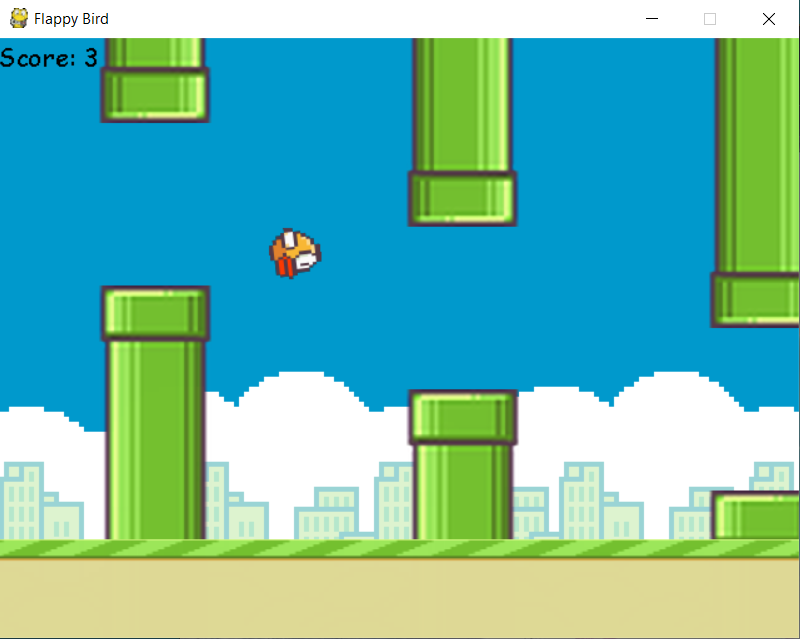

# Flappy bird

## Description

My flappy bird version created for simulation of AI playing the game using NEAT library and pygame with python.

## Instalation

#### 1.Clone repository

#### 2.Run command
>pip install -r requirements.txt

#### 3. If you want to see how the AI learns to play, run command
>python flappybird-neat.py

#### 4. If you want to play the game, run command
>python flappybird.py 

and click any button to fly, the game will restart automatically 1 second after you hit the pipe or the base.
